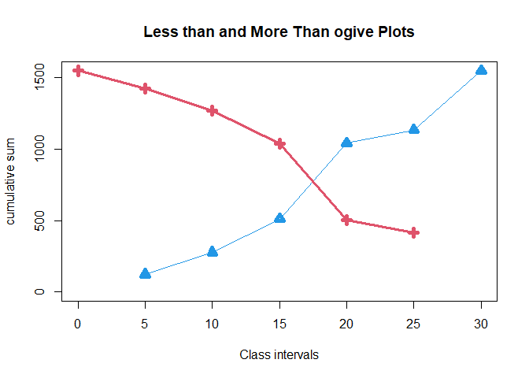
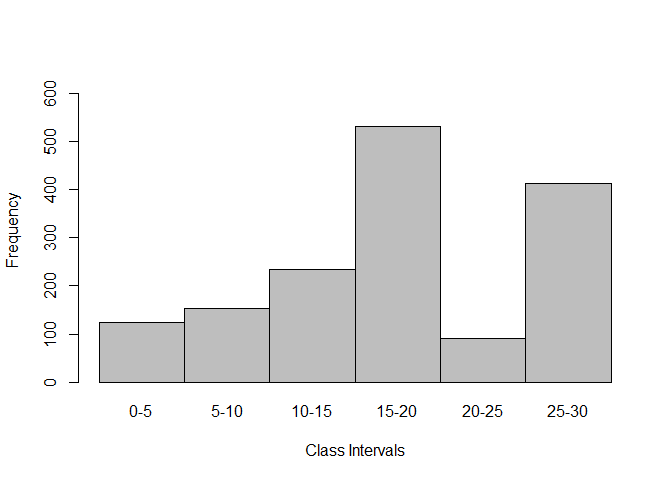

<!-- README.md is generated from README.Rmd. Please edit that file -->

# freqdistributionNogives

<!-- badges: start -->
<!-- badges: end -->

The goal of freqdistributionNogives is to automate the process of
GROUPED FREQUENCY DISTRIBUTION data-framing and cumulative frequency
graph.

## Installation

You can install the development version of freqdistributionNogives like
so: The Public Repository can be accessed in the following manner:-

``` r
# FILL THIS IN! HOW CAN PEOPLE INSTALL YOUR DEV PACKAGE?
Development Package Link :- https://github.com/Harshit-Budakoti/packagetest
1)Install the package devtools in Rstudio.
install.packages(devtools)
2)Run the code given below to install the Development Version Repository using
##devtools::install_github('Harshit-Budakoti/packagetest')
3) After installation:-
use the function basicfreqdist(lowerclasslimits,upperclasslimits,frequencies)
The working of the packages has been illustrated using an example.
```

## Example

This is a basic example which shows you how to use this package to get
automated frequency distribution table with cumulative frequencies and
cumulative frequency plot:

``` r
library(freqdistributionNogives)
lowerlimits=c(0,5,10,15,20,25)
upperlimits=c(5,10,15,20,25,30)
frequencies=c(124,153,234,531,91,414)
basicfreqdist(lowerlimits,upperlimits,frequencies)
```



    #>   LL UL classmark freq morecf lesscf
    #> 1  0  5       2.5  124   1547    124
    #> 2  5 10       7.5  153   1423    277
    #> 3 10 15      12.5  234   1270    511
    #> 4 15 20      17.5  531   1036   1042
    #> 5 20 25      22.5   91    505   1133
    #> 6 25 30      27.5  414    414   1547

    ## basic example code

\`\`\`

The figure given below gives us the Histogram plot of the given data

